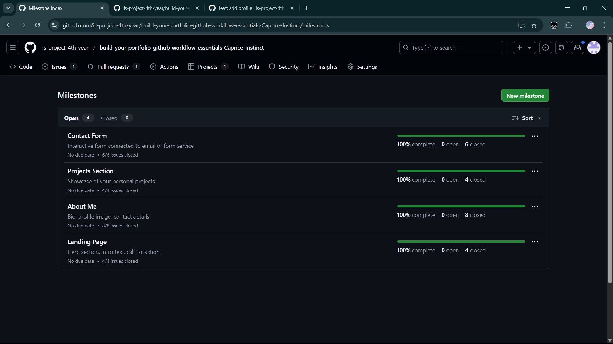
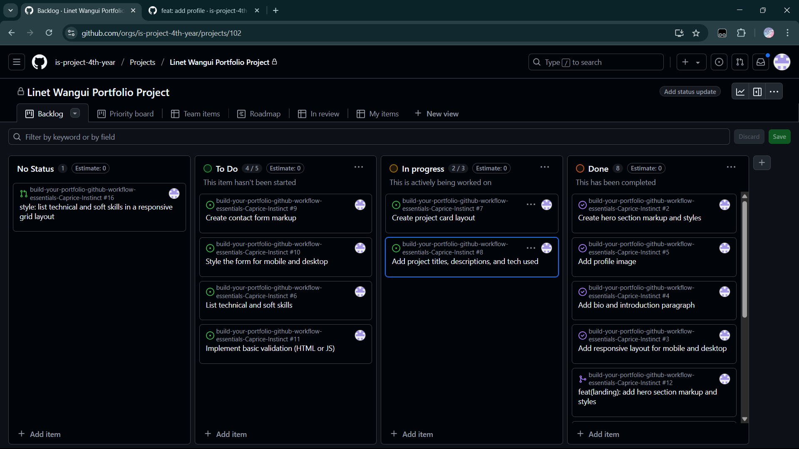
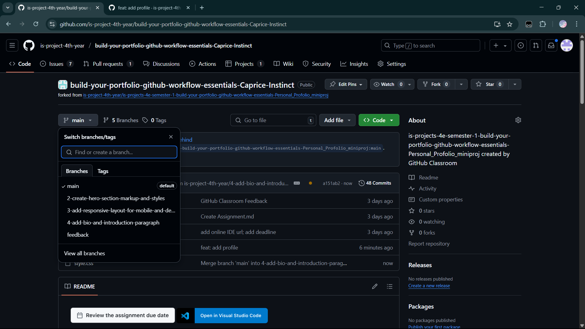
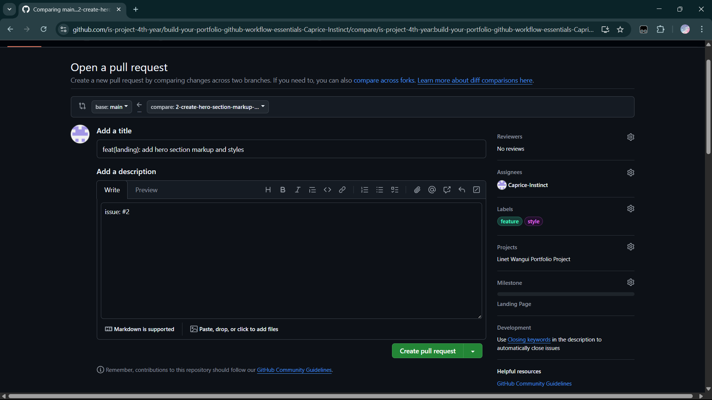
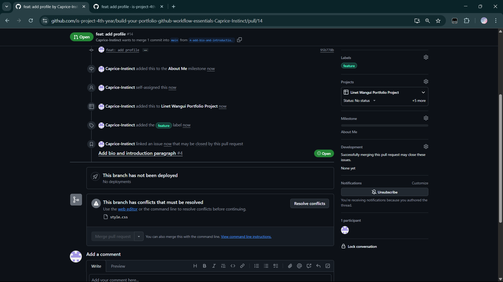
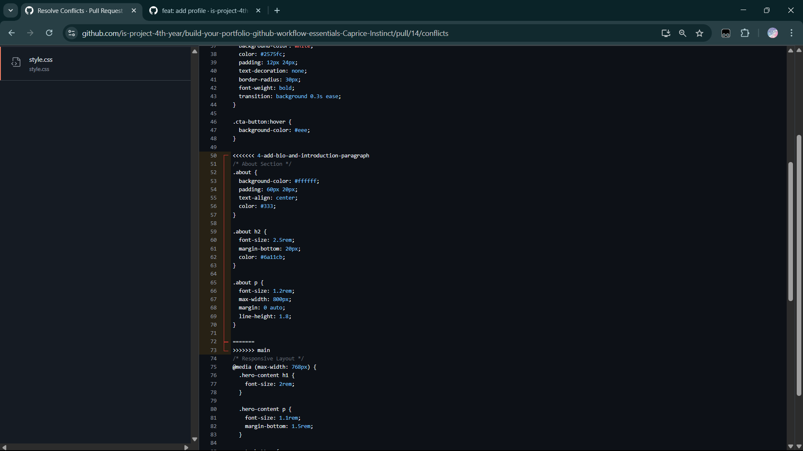
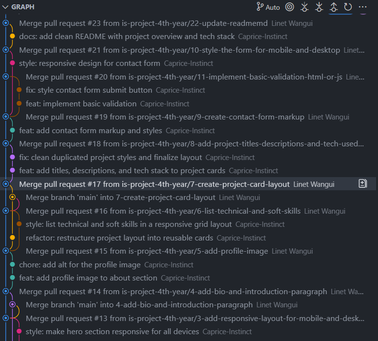

# Personal Portfolio Documentation

## 1. Student Details

- **Full Name**: Linet Wangui Wabuga
- **GitHub Username**: Caprice-Instinct
- **Email**: linet.wabuga@strathmore.edu

## 2. Deployed Portfolio Link

- **GitHub Pages URL**:  
  https://is-project-4th-year.github.io/build-your-portfolio-github-workflow-essentials-Caprice-Instinct/

## 3. Learnings from the Git Crash Program

- **Branching**: Helped me separate features and prevent conflicts when working on different sections of the site. I could develop each feature independently and merge them safely.

- **Commit Conventions**: Structured commit messages made it easier to track the purpose of changes. This was especially helpful when reviewing commit history or debugging issues.

- **Pull Requests**: Allowed me to review and document feature branches before merging. It ensured I maintained a clean main branch and caught potential problems early.

- **Merge Conflict Resolution**: I learned how to detect and resolve conflicts when two branches modify the same part of a file. This skill was crucial when collaborating with others or merging overlapping work.

## 4. Screenshots of Key GitHub Features

Include screenshots that demonstrate how you used GitHub to manage your project. For each screenshot, write a short caption explaining what it shows.

> Upload the screenshots to your GitHub repository and reference them here using Markdown image syntax:
> (you could just simply copy and paste the image into the Assignment.md)

### A. Milestones and Issues

- Screenshot showing your milestone(s) and the issues linked to it.

### B. Project Board

- Screenshot of your GitHub Project Board with issues organized into columns (e.g., To Do, In Progress, Done).

### C. Branching

- Screenshot showing your branch list with meaningful naming.

### D. Pull Requests
- Screenshot of a pull request that’s either open or merged and linked to a related issue.

### E. Merge Conflict Resolution

- Screenshot of a resolved merge conflict (in a pull request, commit history, or your local terminal/GitHub Desktop).

